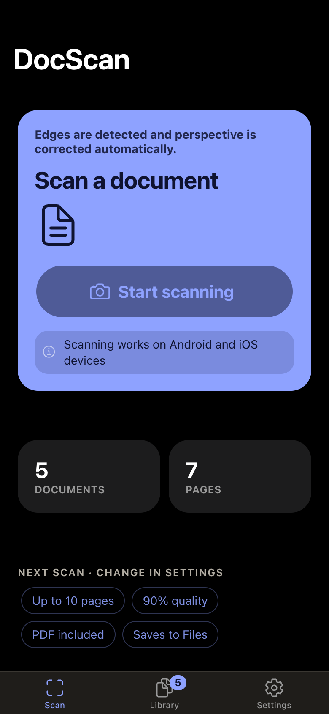
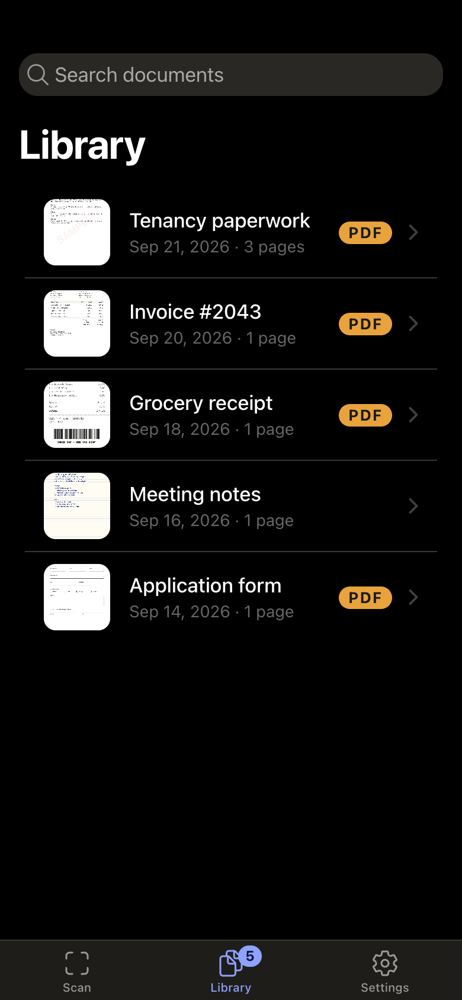
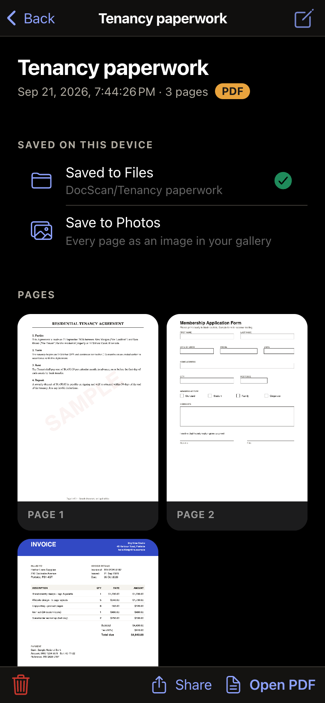
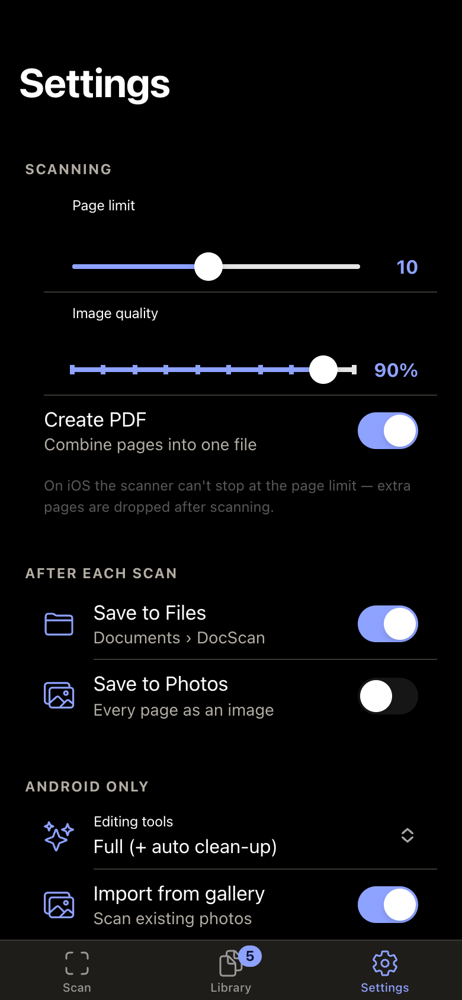

# DocScan

A document scanner app built with **Ionic 9**, **Angular 22** (standalone components + signals) and **Capacitor 8**. Point the camera at a page and DocScan detects the edges, corrects the perspective, and saves the result as images and an optional PDF in a searchable on-device library.

<p align="center">
  
  
  
  
</p>

> The screenshots come from the web build with the sample documents in [`sample-documents/`](sample-documents/) loaded as demo data. The scanner itself needs a real Android or iOS device.

## Features

- **Native scanning**: automatic edge detection and perspective correction through the Capawesome Document Scanner plugin (Google ML Kit on Android, VisionKit on iOS).
- **Multi-page documents** with a configurable page limit and JPEG quality.
- **PDF output**: combine all pages into a single PDF.
- **Library**: browse, search, rename and delete scans. Files live in the app's private storage.
- **Export**: save to Files (iOS) or Documents (Android), save pages to Photos or the gallery, share, or open the PDF in a viewer.
- **Scan recovery**: if the OS kills the WebView while the full-screen scanner is open, the finished scan is recovered instead of lost.
- **Settings**: page limit, image quality, PDF on or off, auto-save destinations, and Android-only options (editing tools, gallery import).
- **Dark theme** and an Ionic UI that follows the platform's look.

## Tech stack

| Area | Choice |
|---|---|
| Framework | Angular 22 (standalone components, signals, lazy-loaded routes) |
| UI | Ionic 9 (`@ionic/angular`) |
| Native runtime | Capacitor 8 (Android + iOS) |
| Scanner | `@capawesome-team/capacitor-document-scanner` |
| File handling | `@capacitor/filesystem`, `@capacitor-community/media`, `@capacitor/share`, `@capawesome-team/capacitor-file-opener` |
| Storage | `@capacitor/preferences` for metadata, the Filesystem API for files |
| Tests | Vitest |

## Prerequisites

- Node.js 20 or newer and npm
- Android Studio (for Android) and/or Xcode (for iOS)
- A **Capawesome npm registry token**. The document scanner plugin is distributed through Capawesome's private registry, so you need your own token to install it. See below.

## Getting started

### 1. Configure the Capawesome registry

Add the registry and **your own** token to your **user-level** `~/.npmrc`, not to this project:

```ini
@capawesome-team:registry=https://npm.registry.capawesome.io
//npm.registry.capawesome.io/:_authToken=<YOUR_CAPAWESOME_TOKEN>
```

Never commit this token. `.npmrc` and `.env*` files are in `.gitignore`.

### 2. Install and run in the browser

```bash
npm install
npm start
```

The web build opens at `http://localhost:4200`. The UI, library and settings work in the browser, but **scanning is disabled** there. The scanner plugin only runs on Android and iOS.

### 3. Run on a device

```bash
npm run build
npx cap sync
npx cap open ios       # or: npx cap open android
```

Then run the app from Xcode or Android Studio on a physical device. Grant the camera permission when prompted.

## Testing with sample documents

[`sample-documents/`](sample-documents/) has seven fictional documents (receipt, invoice, a 3-page agreement, ID card, business cards, handwritten notes, and a form) with PNG previews. Print them, or open the PNGs on a computer screen and point your phone at it. See the folder's README for what each one tests.

## Project structure

```
src/app/
├── components/   # alert, document-item, empty-state, toast
├── enums/        # storage keys
├── interfaces/   # ScanResult, ScanSettings, ScannedDocument
├── pages/        # tabs (scan, library, settings) and document-detail
├── pipes/
└── services/     # scanner, storage, library, settings, recovery, export, feedback
```

Each service has one job. `DocumentScannerService` only talks to the native plugin, `DocumentStorageService` moves files, `DocumentLibraryService` owns the list of documents, and `ScanWorkflowService` ties them together.

## Scripts

| Command | What it does |
|---|---|
| `npm start` | Dev server on port 4200 |
| `npm run build` | Production build into `www/` |
| `npm test` | Unit tests (Vitest) |
| `npm run lint` | ESLint |

## Notes

- App ID: `com.codingtechnyks.docscan`. Change it in `capacitor.config.ts` before publishing your own build.
- On iOS the scanner can't stop at the page limit, so extra pages are dropped after scanning.
